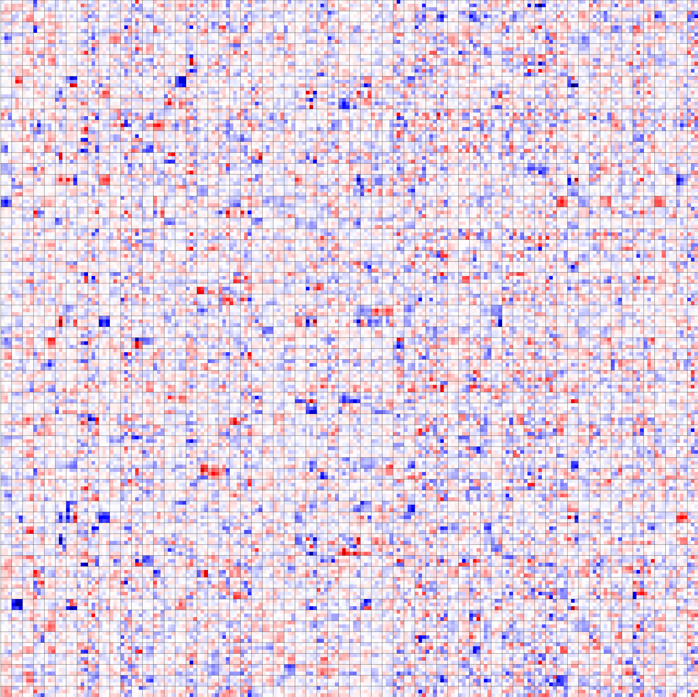
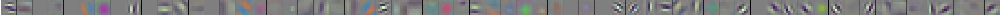
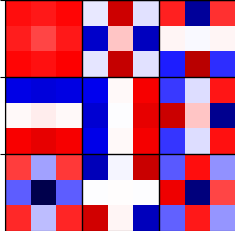
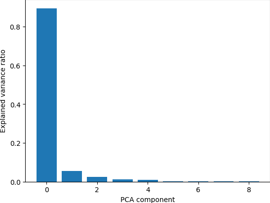

# torchconvview

[](https://pypi.python.org/pypi/torchconvview)
[](https://github.com/paulgavrikov/torchconvview/actions/workflows/pytest.yml)
[![CC BY-SA 4.0][cc-by-sa-shield]][cc-by-sa]


[cc-by-sa]: http://creativecommons.org/licenses/by-sa/4.0/
[cc-by-sa-image]: https://licensebuttons.net/l/by-sa/4.0/88x31.png
[cc-by-sa-shield]: https://img.shields.io/badge/License-CC%20BY--SA%204.0-lightgrey.svg

*A library for PyTorch convolution layer visualizations via matplotlib plots.*


## Installation
To install published releases from PyPi execute:
```bash
pip install torchconvview
```
To update torchconvquality to the latest available version, add the `--upgrade` flag to the above commands.

If you want the latest (potentially unstable) features you can also directly install from the github main branch:
```bash
pip install git+https://github.com/paulgavrikov/torchconvview
```

## Usage

```python
from torchconvvision import plot_conv, plot_conv_rgb, PCAView
import matplotlib.pyplot as plt

# Replace this with your own model. As an example,
# we will use an ImageNet pretrained ResNet-18.
import torchvision
model = torchvision.models.resnet18(pretrained=True)
```
### General

All `plot_...` functions return a tuple of the matplotlib figure and axes which allow you to customize the plot to your needs. Also most of these functions accept the `img_scale` argument which allows you to specify a multiplier to the resolution.

### Visualize kernels in the convolution layers
Just pass the convolution weight as tensor or numpy into `plot_conv` and you'll get a matplotlib figure of the kernels! Each column is one channel/filter, i.e. this stack of kernels generates a feature-map from all input maps.
```python
plot_conv(model.layer1[1].conv2.weight)
plt.show()
```


### Visualize the first layer
If you have a convolution layer with RGB input (e.g. often the first layer), the you can visualize entire filters. This function maps all kernels to their respective color. Note that this only work on convolution layers with 3 input channels and only produces meaningfull results if these channels are R, G, B feature-maps!

```python
plot_conv_rgb(model.conv1.weight)
plt.show()
```


### PCA of convolution weights
You can also compute the eigenimages/basis vectors of the kernels by using the `PCAView` class. Under the hood it will do a PCA for you. Note, that currently this requires the `scikit-learn` module.

```python
pcaview = PCAView(model.conv1.weight)
pcaview.plot_conv()
plt.show()
```


And to get a handy barplot of the explained variance ratio:
```python
pcaview.plot_variance_ratio()
plt.show()
```



## Citation

Please consider citing our publication if this libary was helpfull to you.
```
@InProceedings{Gavrikov_2022_CVPR,
    author    = {Gavrikov, Paul and Keuper, Janis},
    title     = {CNN Filter DB: An Empirical Investigation of Trained Convolutional Filters},
    booktitle = {Proceedings of the IEEE/CVF Conference on Computer Vision and Pattern Recognition (CVPR)},
    month     = {June},
    year      = {2022},
    pages     = {19066-19076}
}
```

## Legal

This work is licensed under a
[Creative Commons Attribution-ShareAlike 4.0 International License][cc-by-sa].

Funded by the Ministry for Science, Research and Arts, Baden-Wuerttemberg, Germany Grant 32-7545.20/45/1 (Q-AMeLiA).
